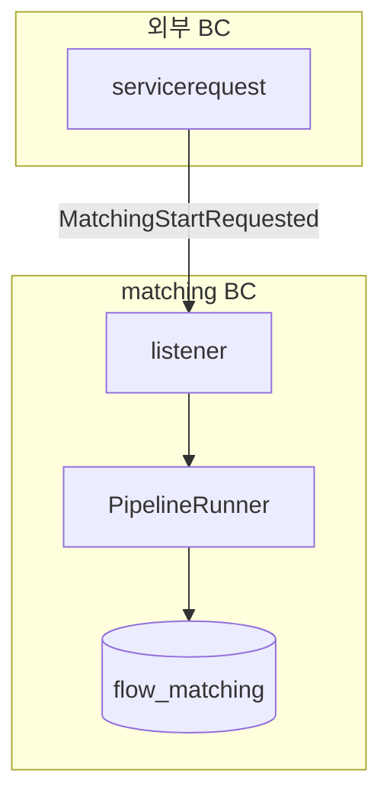
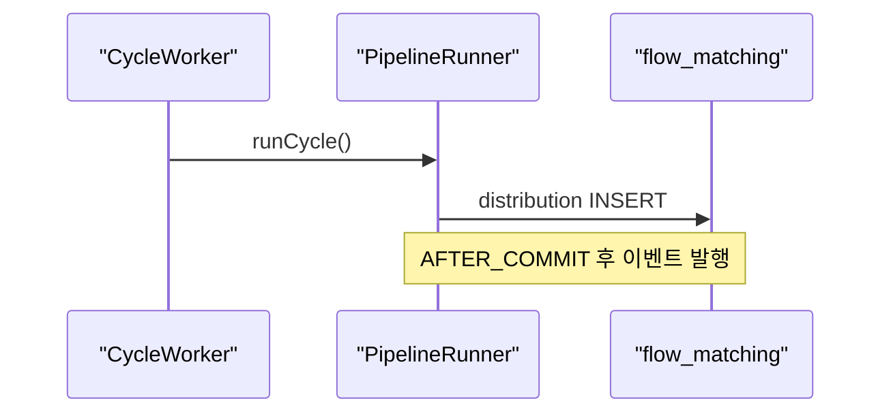
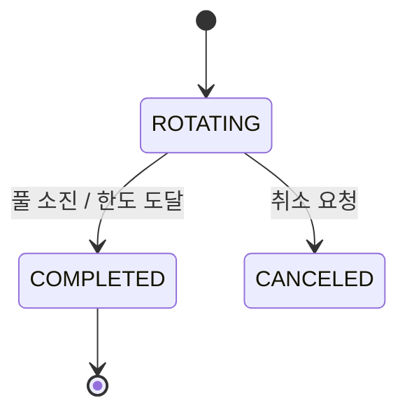
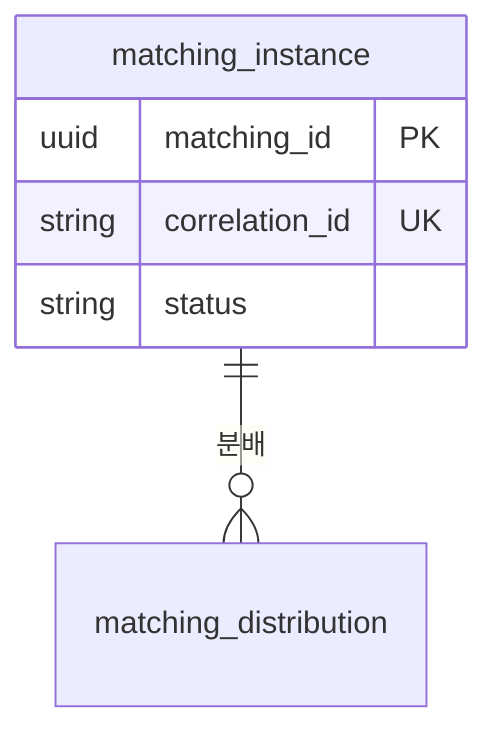

# Notion 출력 가이드

사용자가 문서를 **Notion에 만들어 달라**고 할 때 따른다(예: "노션에 정리해줘", "노션 페이지로 만들어줘"). Notion MCP가 연결돼 있어야 한다 — 도구(`notion-create-pages` 등)가 없으면 연결이 안 된 것이므로 사용자에게 알리고 Markdown/HTML 출력을 제안한다.

핵심은 다른 출력과 같다: **내용·구조는 문서 종류의 템플릿(`work-report.md` 등)을 그대로 따르고, 표현만 Notion 블록으로 입힌다.** HTML+인라인 SVG 방식은 Notion에 넣지 못한다 — Notion은 자체 블록과 Notion-flavored Markdown을 쓴다.

## 1. 작성 전: 스펙과 저장 위치 확정

- **Notion-flavored Markdown 스펙을 먼저 읽는다.** 문법을 추측하지 말고 MCP 리소스 `notion://docs/enhanced-markdown-spec`를 `ReadMcpResourceTool`로 읽어 정확한 블록 문법을 확인한다.
- **저장 위치(parent)를 정한다.** Notion은 페이지가 어딘가에 속해야 한다.
  - 사용자가 위치를 말하지 않았으면 짧게 확인한다("어느 페이지 하위에 만들까요, 아니면 워크스페이스 최상위에 만들까요?").
  - 특정 페이지/DB 하위면 `notion-search`로 그 페이지를 찾아 URL/ID를 얻고, `notion-create-pages`의 `parent`에 `page_id`(또는 DB면 `data_source_id`)로 지정한다.
  - 위치 지정을 생략하면 워크스페이스 최상위 비공개 페이지로 생성된다 — 생성 후 사용자에게 위치를 안내한다.
- **DB에 만든다면** 먼저 `notion-fetch`로 데이터 소스 스키마를 받아 property 이름을 맞춘다.

## 2. 페이지 생성

`notion-create-pages`로 만든다.
- **제목은 `properties.title`에**, 본문 content에는 제목을 넣지 않는다(스펙 규칙).
- content는 Notion-flavored Markdown. **들여쓰기는 탭**, 코드블록 안에서는 escape하지 않는다(리터럴 그대로).
- 기존 페이지를 갱신하면 `notion-update-page`.

## 3. 종류별 컴포넌트 → Notion 블록 매핑

HTML 컴포넌트를 Notion 블록으로 옮긴다. 모든 서식은 HTML이 아니라 Notion-flavored Markdown으로 쓴다.

| 용도 | Notion 블록 |
|------|-------------|
| 요약 박스 (보고서/분석 상단) | `<callout icon="📌">` |
| RAG 상태 헤더 (진행/추적) | `<callout icon="🟡" color="yellow_bg">` (green/yellow/red 현실에 맞게) |
| Breaking Change 경고 | `<callout icon="⚠️" color="red_bg">` |
| 주의 | `<callout icon="⚠️" color="yellow_bg">` |
| ADR status 배지 | 본문 상단 인라인 `<span color="...">Proposed</span>` 또는 callout |
| 장단점 대비 (ADR 대안/Consequences) | `<columns>` 2열 — 좌 `green_bg` 콜아웃(장점) / 우 `red_bg`(단점) |
| 체크리스트 (진행/추적) | `- [ ]` / `- [x]` to-do |
| 상태 표 | `<table header-row="true">` (상태 셀에 `<td color="green_bg">`) |
| 목차 (긴 가이드) | `<table_of_contents/>` |
| 코드/명령어 | ` ```language ` 코드블록 |

색 이름은 스펙의 팔레트를 쓴다: 텍스트색 `green/yellow/red/blue/gray...`, 배경 `green_bg/yellow_bg/red_bg/...`.

## 4. 다이어그램 / 시각화 — Mermaid 코드블록

Notion에서 가장 적절한 시각화는 **Mermaid 코드블록**이다. Notion이 네이티브로 렌더하므로 빌드 도구도 외부 호스팅도 필요 없다 — ` ```mermaid ` 코드블록에 정의만 넣으면 된다. (HTML 출력의 인라인 SVG와 달리, Notion에서는 mermaid가 정답이다. SVG→이미지 업로드는 외부 URL이 필요해 부적절하다.)

작성 규칙(스펙):
- 노드 텍스트에 괄호 등 특수문자가 있으면 **큰따옴표로 감싼다**: `A["Notion (App + API)"]`.
- 줄바꿈은 `<br>`. `\n`이나 `\(` `\)`를 쓰지 않는다.
- 코드블록 안은 escape하지 않는다.

문서 종류·표현 대상에 맞춰 고른다(아키텍처=flowchart, 순서=sequence, 상태=state, 데이터=ER):

### 아키텍처 / 컴포넌트 — `flowchart`


### 시퀀스 / 흐름 — `sequenceDiagram`


### 상태 전이도 — `stateDiagram-v2`


### ER / 데이터 모델 — `erDiagram`


## 5. 공통 원칙 유지

- 빈 섹션은 넣지 않고, 요약을 위에 두고, 추측과 사실을 구분한다.
- 하나의 다이어그램은 하나의 메시지 — 관심사별로 나눈다.
- 생성 후 **페이지 URL을 사용자에게 안내**한다.
- 색·배지는 의미를 전달할 때만(특히 진행/추적 RAG는 현실 반영 — 보기 좋으라고 green 주지 않는다).
