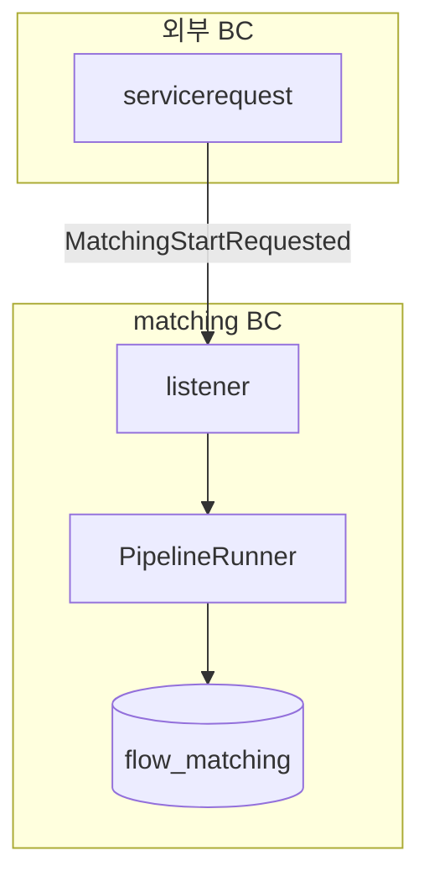
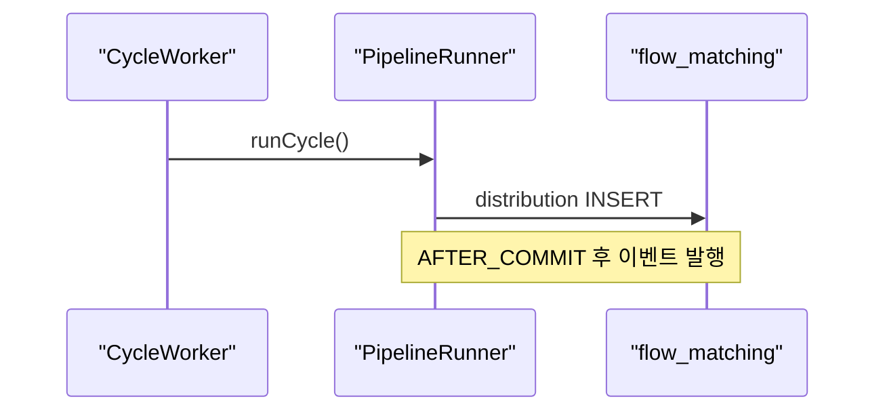
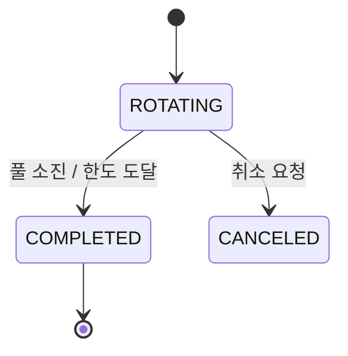
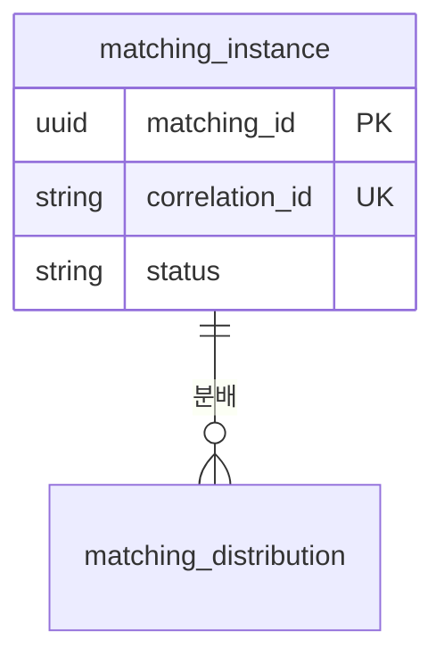

# Notion 출력 가이드

사용자가 문서를 **Notion에 만들어 달라**고 할 때 따른다(예: "노션에 정리해줘", "노션 페이지로 만들어줘"). Notion MCP가 연결돼 있어야 한다 — 도구(`notion-create-pages` 등)가 없으면 연결이 안 된 것이므로 사용자에게 알리고 Markdown/HTML 출력을 제안한다.

핵심은 다른 출력과 같다: **내용·구조는 문서 종류의 템플릿(`work-report.md` 등)을 그대로 따르고, 표현만 Notion 블록으로 입힌다.** HTML+인라인 SVG 방식은 Notion에 넣지 못한다 — Notion은 자체 블록과 Notion-flavored Markdown을 쓴다.

## 1. 작성 전: 스펙과 저장 위치 확정

- **Notion-flavored Markdown 스펙을 먼저 읽는다.** 문법을 추측하지 말고 MCP 리소스 `notion://docs/enhanced-markdown-spec`를 `ReadMcpResourceTool`로 읽어 정확한 블록 문법을 확인한다.
- **저장 위치(parent)를 정한다.** Notion은 페이지가 어딘가에 속해야 한다.
  - 사용자가 위치를 말하지 않았으면 짧게 확인한다("어느 페이지 하위에 만들까요, 아니면 워크스페이스 최상위에 만들까요?").
  - 특정 페이지/DB 하위면 `notion-search`로 그 페이지를 찾아 URL/ID를 얻고, `notion-create-pages`의 `parent`에 `page_id`(또는 DB면 `data_source_id`)로 지정한다.
  - 위치 지정을 생략하면 워크스페이스 최상위 비공개 페이지로 생성된다 — 생성 후 사용자에게 위치를 안내한다.
- **DB에 만든다면** 먼저 `notion-fetch`로 데이터 소스 스키마를 받아 property 이름을 맞춘다.

## 2. 페이지 생성

`notion-create-pages`로 만든다.
- **제목은 `properties.title`에**, 본문 content에는 제목을 넣지 않는다(스펙 규칙).
- content는 Notion-flavored Markdown. **들여쓰기는 탭**, 코드블록 안에서는 escape하지 않는다(리터럴 그대로).
- 기존 페이지를 갱신하면 `notion-update-page`.

## 3. 종류별 컴포넌트 → Notion 블록 매핑

HTML 컴포넌트를 Notion 블록으로 옮긴다. 모든 서식은 HTML이 아니라 Notion-flavored Markdown으로 쓴다.

| 용도 | Notion 블록 |
|------|-------------|
| 요약 박스 (보고서/분석 상단) | `<callout icon="📌">` |
| RAG 상태 헤더 (진행/추적) | `<callout icon="🟡" color="yellow_bg">` (green/yellow/red 현실에 맞게) |
| Breaking Change 경고 | `<callout icon="⚠️" color="red_bg">` |
| 주의 | `<callout icon="⚠️" color="yellow_bg">` |
| ADR status 배지 | 본문 상단 인라인 `<span color="...">Proposed</span>` 또는 callout |
| 장단점 대비 (ADR 대안/Consequences) | `<columns>` 2열 — 좌 `green_bg` 콜아웃(장점) / 우 `red_bg`(단점) |
| 체크리스트 (진행/추적) | `- [ ]` / `- [x]` to-do |
| 상태 표 | `<table header-row="true">` (상태 셀에 `<td color="green_bg">`) |
| 목차 (긴 가이드) | `<table_of_contents/>` |
| 코드/명령어 | ` ```language ` 코드블록 |

색 이름은 스펙의 팔레트를 쓴다: 텍스트색 `green/yellow/red/blue/gray...`, 배경 `green_bg/yellow_bg/red_bg/...`.

## 4. 다이어그램 / 시각화 — Mermaid 코드블록

Notion에서 가장 적절한 시각화는 **Mermaid 코드블록**이다. Notion이 네이티브로 렌더하므로 빌드 도구도 외부 호스팅도 필요 없다 — ` ```mermaid ` 코드블록에 정의만 넣으면 된다. (HTML 출력의 인라인 SVG와 달리, Notion에서는 mermaid가 정답이다. SVG→이미지 업로드는 외부 URL이 필요해 부적절하다.)

작성 규칙(스펙):
- 노드 텍스트에 괄호 등 특수문자가 있으면 **큰따옴표로 감싼다**: `A["Notion (App + API)"]`.
- 줄바꿈은 `<br>`. `\n`이나 `\(` `\)`를 쓰지 않는다.
- 코드블록 안은 escape하지 않는다.

문서 종류·표현 대상에 맞춰 고른다(아키텍처=flowchart, 순서=sequence, 상태=state, 데이터=ER):

### 아키텍처 / 컴포넌트 — `flowchart`

```mermaid
flowchart TB
  subgraph ext["외부 BC"]
    SR["servicerequest"]
  end
  subgraph matching["matching BC"]
    L["listener"]
    R["PipelineRunner"]
    D[("flow_matching")]
    L --> R --> D
  end
  SR -- "MatchingStartRequested" --> L
```

### 시퀀스 / 흐름 — `sequenceDiagram`

```mermaid
sequenceDiagram
  participant W as "CycleWorker"
  participant R as "PipelineRunner"
  participant DB as "flow_matching"
  W->>R: runCycle()
  R->>DB: distribution INSERT
  Note over R,DB: AFTER_COMMIT 후 이벤트 발행
```

### 상태 전이도 — `stateDiagram-v2`

```mermaid
stateDiagram-v2
  [*] --> ROTATING
  ROTATING --> COMPLETED: 풀 소진 / 한도 도달
  ROTATING --> CANCELED: 취소 요청
  COMPLETED --> [*]
```

### ER / 데이터 모델 — `erDiagram`

```mermaid
erDiagram
  matching_instance ||--o{ matching_distribution : "분배"
  matching_instance {
    uuid matching_id PK
    string correlation_id UK
    string status
  }
```

## 5. 공통 원칙 유지

- 빈 섹션은 넣지 않고, 요약을 위에 두고, 추측과 사실을 구분한다.
- 하나의 다이어그램은 하나의 메시지 — 관심사별로 나눈다.
- 수치 비교·추이는 **표로** 표현한다 — HTML의 SVG 데이터 차트는 Notion에 넣을 수 없고, mermaid 차트 계열은 렌더가 보장되지 않는다.
- 생성 후 **페이지 URL을 사용자에게 안내**한다.
- 색·배지는 의미를 전달할 때만(특히 진행/추적 RAG는 현실 반영 — 보기 좋으라고 green 주지 않는다).

## 6. 편집 시 기술적 함정 — 검증 없이 넘어가면 사고로 이어진다

`notion-create-pages` / `notion-update-page` 실사용에서 실제로 페이지 손상 사고가 난 패턴들이다. 매번 확인한다.

- **개행은 실제 줄바꿈 문자로 넣는다.** 도구 호출 파라미터에 리터럴 `\n` 두 글자(백슬래시+n)를 넣으면, Notion이 그 문자열을 파싱하지 못하고 마크다운 전체가 텍스트 하나로 뭉개지거나(`<page>` 등 태그가 이스케이프된 채로 그대로 노출) 개행이 사라진 채(`n`만 남는 등) 저장된다. 항상 실제 줄바꿈으로 작성하고, 저장 직후 `fetch`로 렌더 결과를 확인한다.
- **대규모 개편은 `replace_content`보다 `update_content`(검색/치환)를 우선한다.** `replace_content`는 새 내용에 포함되지 않은 기존 자식 페이지/DB를 감지하면 "N개를 삭제하게 된다"는 오류로 막는데, `allow_deleting_content: true`로 밀어붙이면 **정말로 삭제(휴지통 이동)된다** — 새 콘텐츠에 그 페이지를 `<page url="...">` 로 명시했더라도 위 개행 문제 등으로 태그 파싱이 실패하면 함께 지워진다. 기존 하위 페이지를 유지해야 하는 편집은 `update_content`로 필요한 부분만 바꾼다.
- **`<page>` 태그로 이미 휴지통(deleted)에 있는 페이지를 다시 참조해도 복구되지 않는다.** 조용히 `<mention-page>`(깨진 링크)로 강등될 뿐이다. 사고가 나면 복구를 시도하지 말고 같은 내용으로 새 하위 페이지를 만들어 링크를 교체한다.
- **편집마다 `fetch`로 재조회해 실제 반영 상태를 확인한다.** 도구 호출이 에러 없이 성공해도 내용이 깨졌을 수 있다 — 성공 응답을 검증으로 착각하지 않는다.
- **사용자가 Notion UI에서 동시에 편집 중일 수 있다.** 오래된 fetch 결과를 `old_str` 기준으로 재사용하면 "No matches found"로 실패한다 — 편집 직전에 항상 최신 상태를 다시 `fetch`한다.

## 7. 표현 원칙 — 가독성이 떨어지는 패턴을 피한다

- **여러 항목의 매핑(A→B, C→D, ...)을 콤마로 이어붙인 백틱 범벅 문장으로 쓰지 않는다.** Notion 네이티브 `<table>`로 만든다 — 특히 코드블록으로까지 감싸면 문서 품질이 떨어진다.
- **다이어그램(요약)과 표(상세)는 짝을 지어 붙여 배치한다.** 연관 콘텐츠가 페이지 안에서 멀리 떨어지면 관계가 안 드러난다. 표가 다이어그램과 같은 정보를 그대로 반복하면, 표는 `<details><summary>표 보기 — ...</summary>...</details>` 토글로 접어 다이어그램만 먼저 보이게 하고 상세는 펼쳐서 보게 한다.
- **헤더 대신 굵은 글씨로 소제목을 대신할 때(`##`/`###`를 안 쓸 때) 반드시 `<empty-block/>`으로 앞뒤를 띄운다.** Notion은 헤딩 블록엔 자동 여백을 주지만 굵은 텍스트·코드블록·표·mermaid 앞뒤에는 주지 않아, 여러 주제가 붙어 보인다. 코드블록/표/다이어그램 앞뒤에도 동일하게 적용한다.
- **항목이 많은 목록(10개 이상)은 `<details>` 토글로 접어 스캔성을 높인다.**

## 8. 현재상태 문서는 본문에 이력을 남기지 않는다

위키·아키텍처 개요·엔지니어링 가이드처럼 **항상 최신 상태만 보여주면 되는 문서**는 본문에 날짜 스탬프("2026-08-19 기준" 등)나 "예전엔 이랬는데 지금은 이렇다" 식 이력 비교를 넣지 않는다. 다른 문서가 낡은 상태라는 사실을 발견해도 그 비교 서술은 본문에 남기지 않고 현재 사실만 쓴다 — 변경 이력의 정본은 git이다.

이 규칙은 "현재 상태 문서"에만 적용된다. 진행/추적·회의록·포스트모템처럼 **이력 자체가 문서의 목적**인 유형에는 적용하지 않는다 — 그 유형은 `progress-tracking.md`/`meeting-notes.md`/`postmortem.md`와 SKILL.md 갱신 규칙대로 이력을 남긴다.
